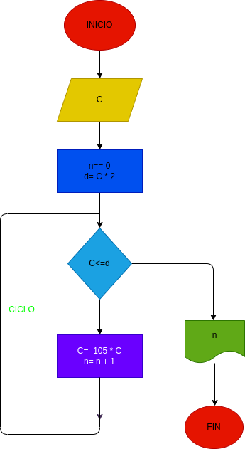

# interes_compuesto
un programa para calcular el interes compuesto

Hacer el diagrama de flujo, y el programa en python, que lea un capital "C", y que averigue e imprima en cuantos meses se duplica si lo colocamos a un interes comuesto del 5% mensual.
